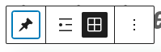
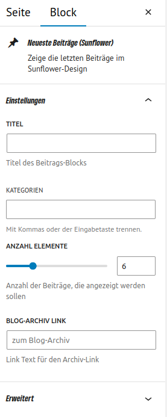
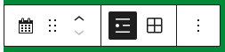
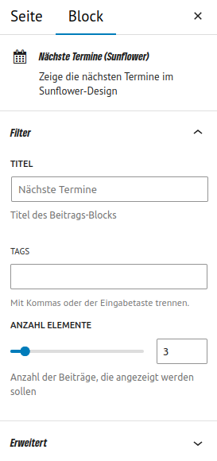
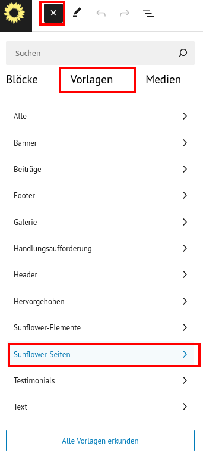

# Blöcke

## Wie lege ich ein vollflächiges Bild an?
- Wähle den Block "Medien > Cover"

## Wie lege ich eine farbige Fläche unter einen Bereich?
- gruppiere die jeweiligen Elemente
- Wählen in den Block-Einstellungen die Farbeinstellungen aus

## Neuste Beiträge (Sunflower)
Das Sunflower Theme liefert einige eigene Blöcke mit sich. Unter anderem den Neuste Beiträge (Sunflower) Block. Dort kannst du ein paar Einstellungen vornehmen.

### Raster- vs. Listenansicht
Seit dem Release von 2.1 kannst du die Ansicht beim Sunflowerblock umstellen. Dafür musst du nur im Block oben über den Button die Ansicht einstellen. Es ist eine reine gestalterische und geschmackliche Frage, wie du die neusten Beiträge angezeigt haben möchtest. Direkt durch das Umstellen der Einstellung siehst du im Backend, wie die Darstellung aussieht.

<figure markdown="span">
  { width="" }
  <figcaption>Ansicht umstellen</figcaption>
</figure>

Im Bild ist die Rasteransicht ausgewählt. Links daneben siehst du den Button für die Listenansicht.

### Einstellungen
<figure markdown="span">
  { width="" }
  <figcaption>Einstellmöglichkeiten für die Neusten Beiträge (Sunflower)</figcaption>
</figure>

Die Einstellungen für den Block siehst du bei der Auswahl des Blocks an der rechten Seite. Wenn du ihn nicht siehst, dann wähle den Block aus und stele sicher, dass im oberen Rechten Abschnitt auch Block (nicht Seite) ausgewählt ist. Dort befinden sich nun weitere Einstellmöglichkeiten für diesen Block.

## Nächste Termine (Sunflower)
Der Block *Nächste Termine (Sunflower)* wurde übersetzt. innerhlab des Blocks gibt es nun ebenfalls eine Silbentrennung des Textes. Dies fördert die Benutzerfreundlichkeit.

### Raster- vs. Listenansicht
Auch in diesem Block kannst du die Ansicht der nächsten Termine steuern.

<figure markdown="span">
  { width="" }
  <figcaption>Ansicht umstellen</figcaption>
</figure>

Im Bild ist die Listenansicht ausgewählt. rechts daneben siehst du den Button für die Rasteransicht.

### Einstellungen
<figure markdown="span">
  { width="" }
  <figcaption>Einstellmöglichkeiten für die nächste Termine (Sunflower)</figcaption>
</figure>

## RSS-Block
Wi rhaben den RSS Block angepasst. Darüber könntest du Beiträge einer anderen Gliederung z.B. auf deiner Seite mit anzeigen lassen. Dafür nutze einfach den entsprechenden RSS-Link der Seite und füge ihn ein. So kannst du von unterschiedlichen Gliederungen die neusten News anzeigen lassen und direkt auf deren Seite verlinken.

## Vorlagen
Es gibt auch Vorlagen für typische Szenarien wie z.B. die Startseite und Kandidirenden Seite. Du findest sie beim Erstellen einer neuen Seite in den Vorlagen:
<figure markdown="span">
  { width="" }
  <figcaption>Vorlage in Seite laden</figcaption>
</figure>
