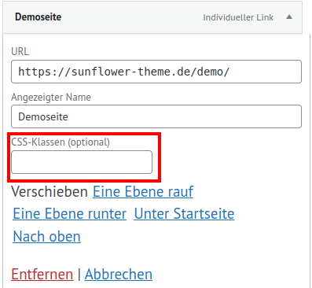
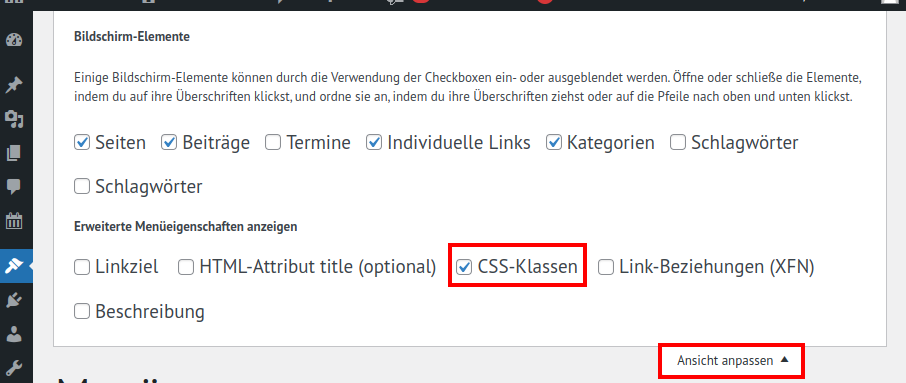

# Menüs

Unter Design > Menüs musst Du mindestens ein Hauptmenü erzeugen und es unter *Positionen verwalten* der
Position "Hauptmenü" zuweisen.

## Wie kann ich Links im Menü in einem neuen Fenster öffnen lassen?
- Beim Menü, gehe auf *Ansicht anpassen* rechts oben
- Setze bei *Erweiterte Menüeigenschaften anzeigen* den Haken für *Linkziel*
- Nun siehst Du bei jedem Menüeintrag die Einstellung *Link in einem neuen Tab öffnen*

## Wie setze ich die Sonneblume auf grünen Hintergrund?
Das passiert automatisch: Wir haben die Header angepasst. Solange du das Logo der Grünen bestätigt hast, wird die Sonnenblume nun auch auf dem grünen Hintergrund angezeigt. Wenn du ein eigenes Logo eingebunden hast, ist der Hintergrund natrülich weiß.

## Wie setze ich einen Highlight-Button?
- Für den Highlight-Button musst du im Backend an die Stelle gehen, an den du dein Menü bearbeiten kannst.
- Stelle sicher, dass du beim bearbeiten eines Menüpunktes eine Optionale CSS-Klasse hinterlegen kannst.
<figure markdown="span">
  { width="" }
  <figcaption>CSS-Klasse hinterlegen</figcaption>
</figure>
- Siehst du das feld nicht, gehe ganz oben auf der Seite auf *Ansicht anpassen* und aktiviere CSS-Klassen.
- Trage nun beim gewünschten Menü-item *button-highlight* ein.
<figure markdown="span">
  { width="" }
  <figcaption>CSS-Klasse hinterlegen können aktivieren</figcaption>
</figure>
- Wenn du den Standard-Header benutzt, wird das erste Element im Hauptmenü auch Mobil im Header angezeigt.

## Wie kann ich Zeichen vor Menü Items setzen?
- Um beispielsweise ein Herz vor einem Menü-Punkt zu setzen, gebe in die CSS-Klasse folgendes ein *fa-solid fa-heart*. Das sind Klassen von Fontawesome.
- Dort findest du weitere zeichen, die du ergänzen kannst.
- *fa-solid* ist dafür verantwortlich, dass die Zeichen ausgefüllt sind.
