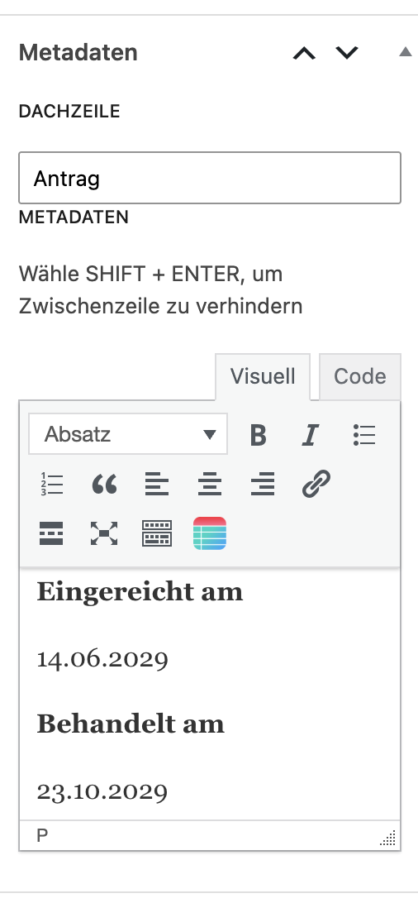

# Anträge und Beschlüsse

Um Anträge oder Beschlüsse sinnvoller darzustellen, kannst Du Metadaten zu Beiträgen hinzufügen.

Dazu findest Du rechts im Seiteninspektor im Backend den Bereich *Metadaten*. 

<figure markdown="span">
  { width="" }
  <figcaption>Text für grünen Kasten eingeben</figcaption>
</figure>

Was Du hier  einträgst, erscheint im Kopfbereich in einem eignen grünen Kasten.

<figure markdown="span">
  { width="" }
  <figcaption>Textfarbe und Hintergrundfarbe einstellen</figcaption>
</figure>

Auf der Demoseite findest Du ein Beispiel unter [*Anträge*](https://sunflower-theme.de/demo/category/antraege/).
