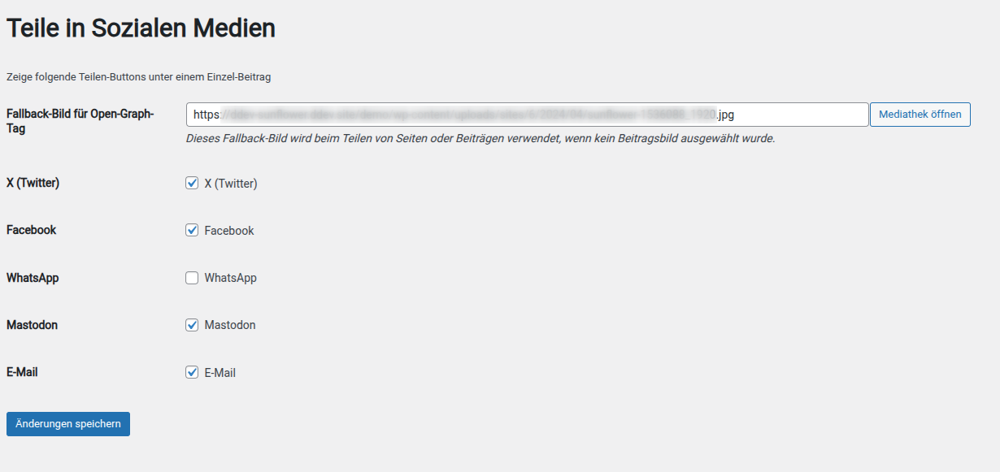

# Einrichtung

Nach der Installation des Themes musst Du einige Einstellungen vornehmen. Dafür findest Du im Dashboard einen Menü-Punkt "Sunflower":

<figure markdown="span">
  { width="" }
  <figcaption>Das Sunflower-Menü im Dashboard</figcaption>
</figure>


## Erste Schritte

###  Theme aktivieren

Um die Sonnenblume als Logo und Icon nutzen zu können, musst Du Dir die Nutzungsbedingungen durchlesen und akzeptieren. Andernfalls wird die Sonnenblume nicht angezeigt. Du kannst das Theme trotzdem nutzen und Dein eigenes Logo verwenden.

<figure markdown="span">
  { width="" }
  <figcaption>Das Sunflower-Menü im Dashboard</figcaption>
</figure>

### Umzug von Urwahl 3000

Hier gibt es ausführlichere Hinweise zum [Umzug von Urwahl3000](urwahl3000.md).

## Einstellungen

### Menüs
Lege zunächst das Hauptmenü und ggf. auch die weiteren Menüs an und lege deren Positionen fest. [mehr](menus.md)

## Startseite
Für die Startseite kannst Du die Musterinhalte der Demoseite verwenden. [mehr](homepage.md)

## Musterbilder
Das Theme bietet eine Reihe von Platzhalter- und Musterbilder an, die Du frei verwenden darfst.
Du kannst sie mit nur einem Klick in Deine WordPress-Mediathek importieren. Gehe dazu in die Sunflower-Einstellungen
und klicke auf den entsprechenden Import-Button.
Folgende Bilder gibt es aktuell:


## Social-Media-Profile

### Icons in der Fußleiste

Du kannst beliebige Social-Media-Profile in beliebiger Reihenfolge in der Fußzeile der Webseite anzeigen. Trage dazu in den Sunflower-Einstellungen die Profile in folgendem Format ein:

```
Fontawesome-Klasse;Title-Attribut;URL
```

- den korrekten Klassennamen findest Du bei [Fontawesome](https://fontawesome.com/icons?d=gallery&p=2&m=free)
- das title-Attribut wird beim Hovern mit der Maus angezeigt
- die URL ist die komplette Adresse Deines Social-Media-Profiles, beginnend mit `https://`

Zeilen ohne URL werden nicht berücksichtigt, Du kannst sie als Muster gerne behalten.

### Teile in Sozialen Medien

In der Einzelansicht von Beiträgen kannst Du Icons zum Teilen via X (Twitter), Facebook und per E-Mail anzeigen. Ein Klick auf die Icons öffnet dann das jeweilige Soziale Netz und Du kannst den Beitrag dort teilen. Das ist unabhängig davon, ob Du auf den Plattformen selbst einen Account hast.

Im Falle von E-Mail wird Dein Email-Programm geöffnet.

Du kannst auch einfach die URL des Beitrags kopieren und ihn im Netzwerk Deiner Wahl posten. Meist versucht das Netzwerk, das Beitragsbild er holen um den Post attraktiver zu machen. Hast Du kein Beitragsbild vergeben, kannst Du ein Standard-Bild für solche Fälle festlegen. Ansonsten wählt das *Sunflower* ein Bild für Dich aus.

`Sunflower -> Profile in Sozialen Medien -> Teile in Sozialen Medien`

<figure markdown="span">
  { width="" }
  <figcaption>Sunflower-Einstellungen: Teile in Sozialen Medien</figcaption>
</figure>


## Automatische Updates aktivieren

Für jedes Theme muss in Worpdress die automatische Aktualisierung aktiviert werden. Auch das sunflower Theme kann auf diese Weise automatisch aktualisiert werden.

Gehe dazu in

### Single Instanz

`Design -> Themes -> Sunflower ("Theme Details") -> Automatische Aktualisierungen aktivieren`

### Multi-Site Instanz

`Dashboard -> Netzwerkverwaltung -> Themes -> Automatische Aktualisierungen aktivieren`
