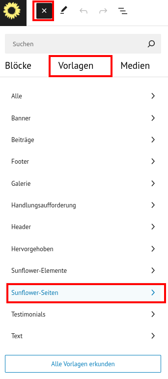

# Vorlagen

Es gibt auch Vorlagen für typische Szenarien wie z.B. die Startseite und Kandidierenden Seite. Du findest sie beim Erstellen einer neuen Seite in den Vorlagen:

<figure markdown="span">
  { width="" }
  <figcaption>Vorlage in Seite laden</figcaption>
</figure>

## Linkseite

Neu ist auch die Vorlage für eine Linkseite. Gerade für Social Media als alternative zu Wonderlink und Linktree interessant. Die Vorlage kann in die entsprechende Seite geladen werden. Es sollte auch der Haken bei "gestyltes Layout" gesetzt werden.

<figure markdown="span">
  { width="" }
  <figcaption>Vorlage in Seite laden</figcaption>
</figure>

## Vorlagen bearbeiten

Bestehende Vorlagen sind bei den *block-patterns* im Sunflower-Theme enthalten.

Erste Ideen hierfür werden in diesem [issue](https://github.com/verdigado/sunflower/issues/528) als Beispiel gesammelt. Für weitere Ideen, gerne mithelfen.
