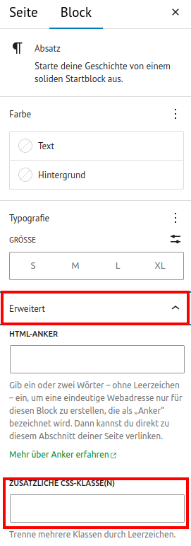
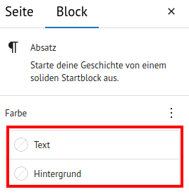

# Typografie

Du kannst Schriften - dabei ist es egal, welches Element sie besitzen (Überschrift, Absatz etc.) - mit dem Textbalken nach dem Grünen CI 2023 hervorheben.

Dazu musst du dem Element die Klasse `.textbalken` mitgeben.

## Wie gebe ich einem Element eine CSS Klasse mit?
Gehe im Element auf *Erweitert*. Dort findest du das Feld *Zusätzliche CSS-Klasse(n)*. Trage dort die Klasse ein.
<figure markdown="span">
  { width="" }
  <figcaption>Zusätzliche CSS-Klasse</figcaption>
</figure>

## Wie style ich einen Textbalken?
Gebe dem Element eine Hintergrundfarbe und Textfarbe mit. So stellst du einen Textbalken mit deinen Farben zusammen.
<figure markdown="span">
  { width="" }
  <figcaption>Textfarbe und Hintergrundfarbe einstellen</figcaption>
</figure>

## Wie rücke ich mehrere Textbalken ein?
Um mit mehreren Textbalken zu arbeiten, hast du die Möglichkeit mit der Klasse `.links-eins` und `.links-zwei` zwei verschiedene Einrückungen vorzunehmen. Dabei wird jeweils auf der linken Seite ein Versatz eingebaut, was das Element nach rechts rutschen lässt.
