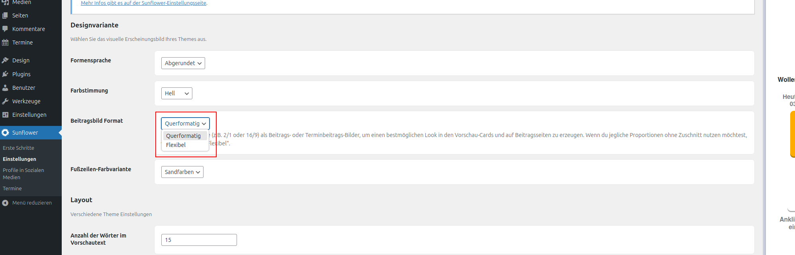

# Umstieg auf Sunflower 26

## Umschalten zwischen den verschiedenen Designs

* Die Anleitungen zum Umschalten zwischen den verschiedenen Designs sind im Rahmen der [Ersten Schritte beim Setup](setup.md) beschrieben.

## Hinweise zu der Nutzung von Bildern

* das neue Theme ist vom Design her darauf ausgerichtet, querformatige Bilder zu nutzen.
* hierbei ist wichtig, dass beim Seitenverhältnis nach Möglichkeit **ein** einheitliches Format genutzt wird.
* also alle 16:9 oder 2:1 oder quadratisch, nicht durchmischt.

## Darstellung von heterogenen Bildformaten

* Da viele bestehende Instanzen noch mit einer Vielfalt von Bildformaten das Theme nutzen, gibt es die Möglichkeit die Darstellung umzuschalten:

* **querformat** um querformatige Bilder bestmöglich zur Geltung zu bringen oder **flexibel**, um die Format-Vielfalt einer bestehenden Instanz zu berücksichtigen.

* verdigado empfiehlt eine strukturierte Durchsicht aller bestehenden Bilder.

<figure markdown="span">
  { width="" }
  <figcaption>Die Nutzenden können können zwischen "Querformatig" und "flexibel" wählen</figcaption>
</figure>

* Wenn man eine Instanz neu aufsetzt, ist querformat als Standard eingestellt. Wenn man eine bestehende Instanz zu Sunflower 26 umzieht, ist "flexibel" als Standard voreingestellt.

## Barrierefreiheit

* Bilder mit Text wie aus SharePics aus SocialMedia Beiträgen werden sehr gerne genutzt, sind aber aus Barrierefreiheitsgründen nicht zu empfehlen. Sehbehinderte Menschen können den Inhalt der Bilder nicht erfassen. Sollten solche Bilder trotzdem verwendet werden muss hier unbedingt auf einen aussagekräftigen ALT-Text geachtet werden.
